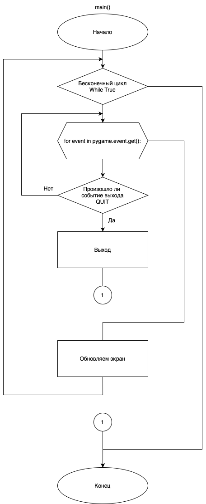
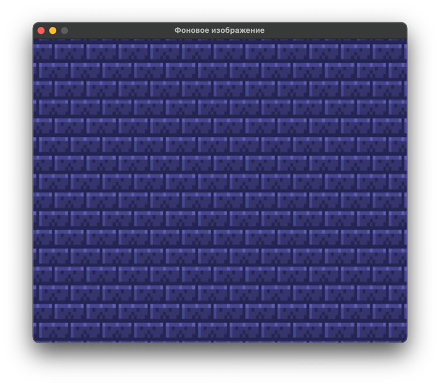

# Практическая работа №22 #

### Тема: Применение библиотек Pygame ###

### Цель: Совершенствование навыков составления программ с библиотекой Pygame ###

#### Задача: ####

> Создайте каркас своей игры (собирание каких-либо объектов), подберите нужные изображения и фон

##### Контрольный пример: #####

> Получаю:
> 1) Создан каркас игры;
> 2) Добавлено фоновое изображение.

##### Системный анализ: #####

> Входные данные: `None`    
> Промежуточные данные: `int screen_width`, `int screen_height`     
> Выходные данные: `background_image`

##### Блок схема: #####



##### Код программы: #####

```python
import pygame

# Инициализация Pygame
pygame.init()

# Ширина и высота экрана
screen_width = 640
screen_height = 520
screen = pygame.display.set_mode((screen_width, screen_height))
pygame.display.set_caption('Фоновое изображение')

# Загрузка и масштабирование фонового изображения
background_image = pygame.image.load('background.jpg')
background_image = pygame.transform.scale(background_image, (screen_width, screen_height))

# Основная функция
def main():
    clock = pygame.time.Clock()

    while True:
        for event in pygame.event.get():
            if event.type == pygame.QUIT:
                pygame.quit()
                quit()

        screen.blit(background_image, (0, 0))  # Отображение фонового изображения

        pygame.display.update()
        clock.tick(60)  # Поддержка 60 кадров в секунду

# Запуск основной функции
if __name__ == "__main__":
    main()

```

##### Результат работы программы: #####



##### Контрольные вопросы: #####

1. Модули для работы программы:  
   `pygame`: Библиотека для создания игр, обеспечивающая работу с графикой, звуком и событиями.

2. Функции для работы программы:  
   `main()`: Основная функция программы, управляющая логикой игры, обработкой событий, движением игрока и отрисовкой
   элементов на экране.

##### Вывод по проделанной работе: #####

> В ходе данной практики я впервые познакомился с библиотекой Pygame, сделал каркас игры и добавил фоновое изображение. 
